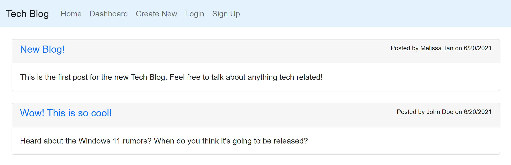
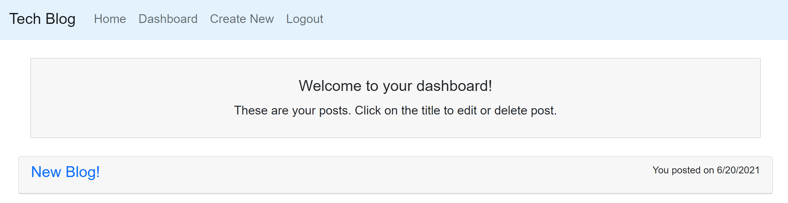
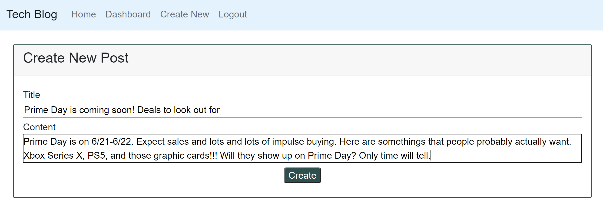
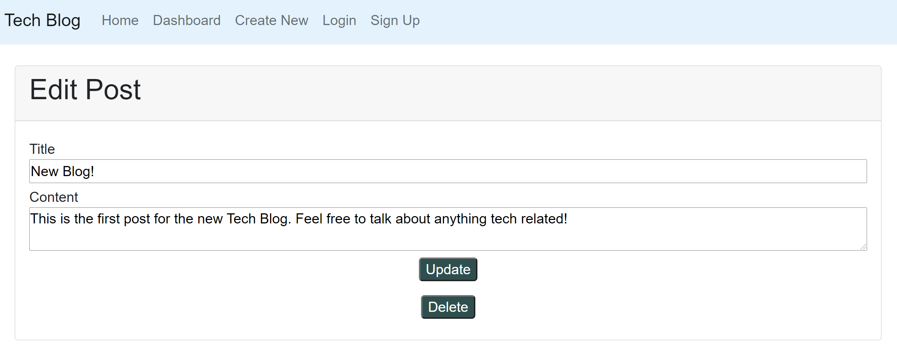
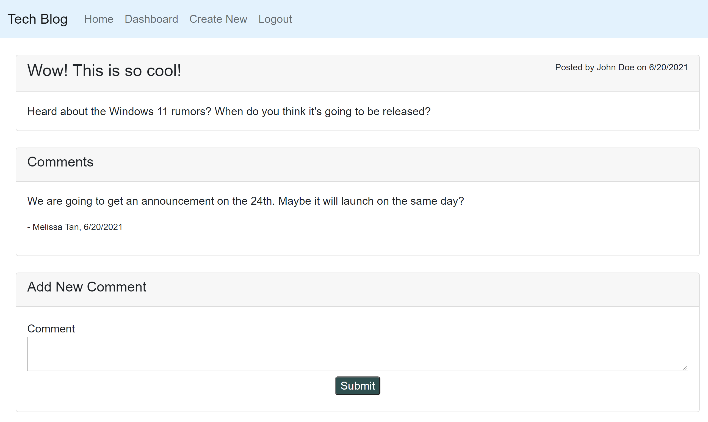

# Tech Blog

[https://shielded-citadel-13864.herokuapp.com/](https://shielded-citadel-13864.herokuapp.com/)
## Description

Note Taker is an application that utilizes Express and manages a web interface with user inputs. The user's information is saved onto the server. 

## Table of Contents

-   [Description](#description)
-   [Usage](#usage)
-   [Contributing](#contributing)
-   [Questions](#questions)

## Usage

1. Go to [Tech Blog](https://shielded-citadel-13864.herokuapp.com/)
2. Once the home page is loaded, please sign up for an account and login
	

3. You will be redirected to the Dashboard where you can see all posts you have created.  
	

4. Click "Create New" to make a new blog post and input a title and content for your post.  
    

5. From the Dashboard, click on the post title to make edits or delete a post.
    

6. Click on home to return to the homepage and click on a post title to make comments on the post.
    

## Contribution

#### Contributors

[Melissa Tan](https://github.com/melissa-tan)

## Questions

If you have any questions or see any issues, please submit an [issue](https://github.com/melissa-tan/tech-blog/issues) on GitHub!